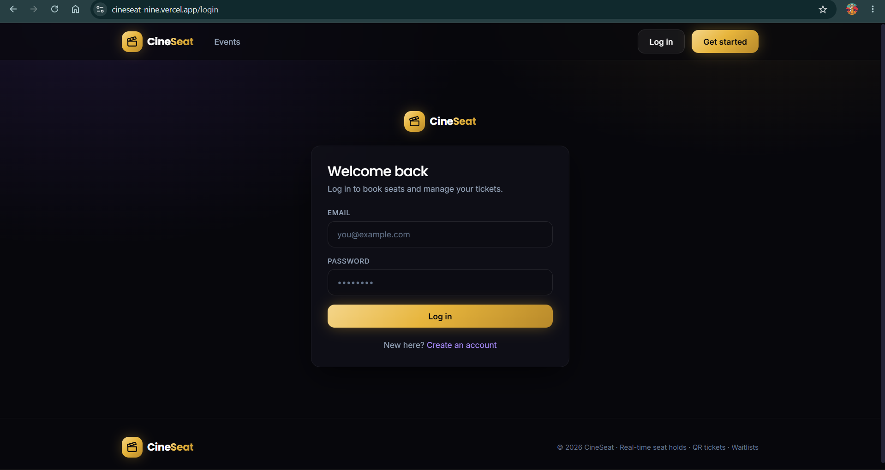
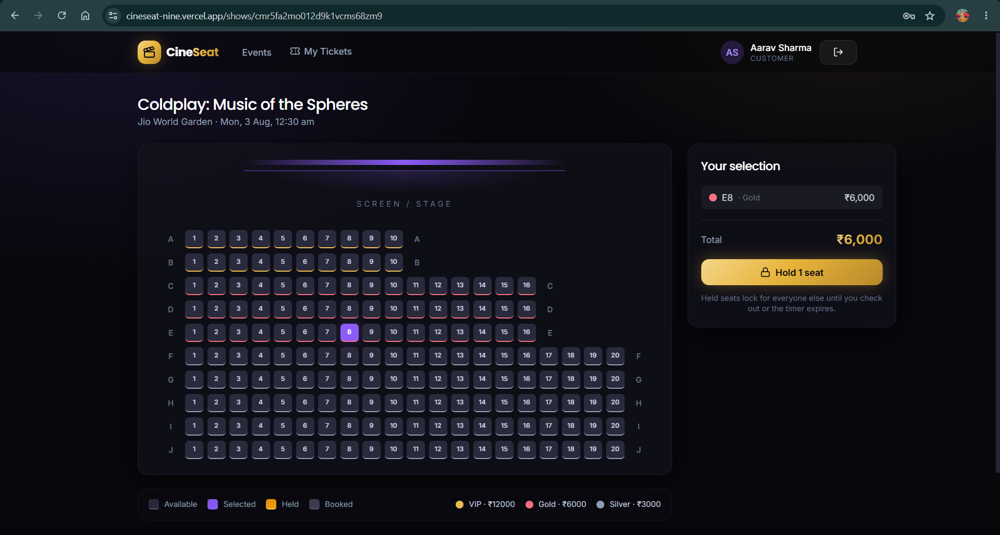
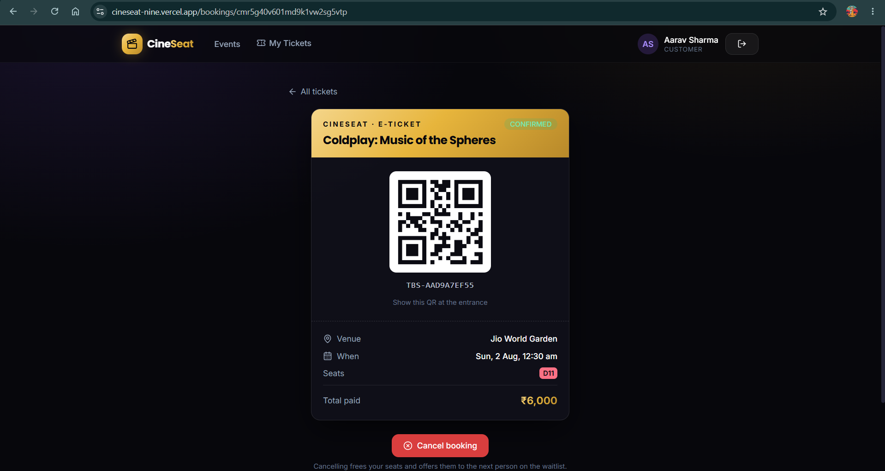
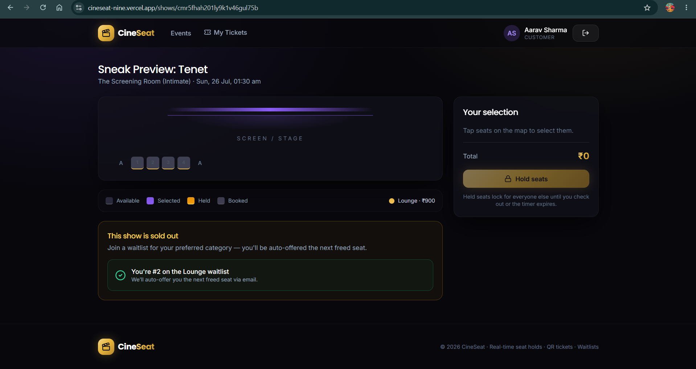
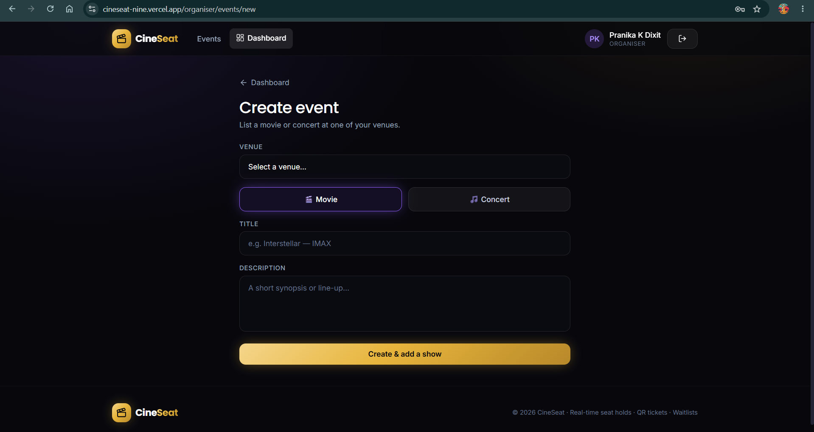
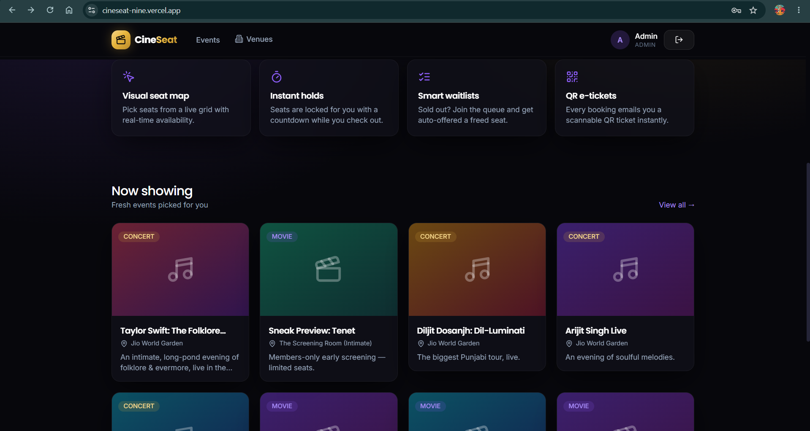

# 🎟️ CineSeat — Ticket Booking System

A full-stack ticket-booking platform for **movies and concerts**: customers book seats from a real-time visual map, held seats auto-release on checkout abandonment, sold-out shows run a **waitlist with automatic seat reallocation**, and every confirmed booking produces a **QR-code email ticket**.

Built for the Unthinkable Solutions assignment.

---

## 🔗 Live Demo

**App:** https://cineseat-nine.vercel.app

> ⏱️ The backend is on Render's free tier and **sleeps after ~15 min idle** — the first request may take ~40s to wake up, then it's fast. Give it a moment on first load.

### Demo logins

| Role | Email | Password |
|---|---|---|
| **Admin** | `admin@ticketing.com` | `admin123` |
| **Organiser** | `organiser@cineseat.com` | `demo1234` |
| **Customer** | `aarav@example.com` | `demo1234` |
| **Customer** | `diya@example.com` | `demo1234` |

The database is pre-seeded with a catalogue (4 movies, 4 concerts, full seat grids). One show — **“Sneak Preview: Tenet”** — is deliberately staged **sold-out with a customer already waitlisted**, so the waitlist → offer-email → claim flow can be demoed in a single click: log in as **Aarav → My Bookings → cancel**, and **Diya** receives the time-limited offer.

> 📧 **Where are the emails?** No real inbox is configured, so tickets and offers are sent to a free **Ethereal** test inbox. Each send logs a preview URL in the **Render → Logs** tab (`preview: https://ethereal.email/...`) — open it to see the rendered email with the QR code.

---

## 📸 Screenshots

| Sign up / Login | Customer — browse & book | QR ticket |
|:---:|:---:|:---:|
|  |  |  |
| **Waitlist (sold-out show)** | **Organiser dashboard** | **Admin — venues & seats** |
|  |  |  |

---

## ✨ Features

Mapped to the assignment's evaluation focus:

- **Visual seat map** with per-seat live status — *available / held / booked* — rendered as a grid, one `ShowSeat` row per seat per show.
- **Seat holds with a configurable TTL** (default 10 min); held seats are locked for everyone else and **auto-release** via a background sweeper on abandonment.
- **Concurrency protection** — two customers can never hold or book the same seat; a guarded conditional update inside a transaction guarantees exactly one winner.
- **Waitlist per seat category** — when sold out, customers queue up (FIFO); on cancellation the freed seat is **auto-offered to the next in line** with a **time-limited link**, cascading down the queue on expiry.
- **QR-code email tickets** — every confirmed booking generates a unique reference, encodes it as a QR code, and emails the ticket.
- **Real-time updates** — Socket.IO pushes `seat:update` events so open seat maps reflect holds/bookings instantly (with a poll fallback).
- **Role-based auth** — Customer / Organiser / Admin, via JWT in an httpOnly cookie.
- **Organiser dashboard** — booking summary, revenue, and occupancy per event/show.

---

## 🧱 Tech Stack

**Backend** — Node.js · Express · TypeScript · Prisma · PostgreSQL · Socket.IO · node-cron · Nodemailer · JWT · Zod
**Frontend** — React 19 · Vite · TypeScript · Tailwind CSS · TanStack Query · Framer Motion · socket.io-client · Recharts
**Hosting** — Neon (Postgres) · Render (API) · Vercel (frontend)

---

## 📂 Project Structure

```
.
├── backend/           # Express + Prisma API, Socket.IO, TTL sweeper
│   ├── prisma/        # schema, migrations, seed
│   ├── src/
│   │   ├── modules/   # auth, venues, events, shows, bookings, waitlist
│   │   ├── lib/       # env, prisma, jwt, qr, mailer
│   │   ├── middleware/# auth (JWT + RBAC), error handler
│   │   ├── realtime.ts# socket.io server
│   │   ├── scheduler.ts# node-cron TTL sweeper
│   │   └── server.ts  # entry point
│   ├── README.md      # ← full setup guide, API reference, DB schema
│   └── DESIGN.md      # ← 800-word system design write-up
└── frontend/          # React + Vite SPA
    └── src/           # pages, components, hooks, api client
```

---

## 🚀 Quick Start (local)

**Prerequisites:** Node 18+, PostgreSQL 13+

### Backend
```bash
cd backend
npm install
cp .env.example .env            # then set DATABASE_URL, JWT_SECRET
npx prisma migrate deploy       # create tables
npx prisma generate
npx ts-node prisma/seed.ts      # seed the admin user
npm run dev                     

### Frontend
```bash
cd frontend
npm install
npm run dev                     
```

The Vite dev server proxies `/api` and `/socket.io` to the backend, so no extra config is needed locally.

📖 **Full setup, environment variables, API reference, and DB schema:** [`backend/README.md`](./backend/README.md)
